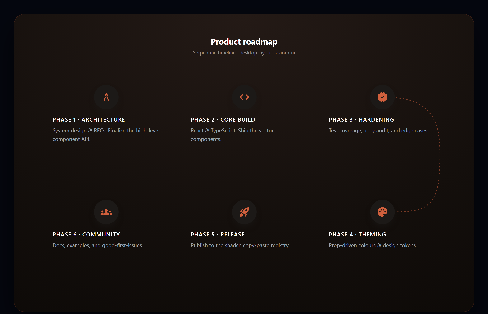

<div align="center">

# axiom-ui

**Distinctive, production-grade React components you own as source.**

No black-box package. No design-system lock-in. Copy the files in, tweak the props, ship.

[](./LICENSE)
[](./CONTRIBUTING.md)


</div>

---

## ✦ Components

### 🗺️ India Map

An interactive, accessible SVG choropleth of India — all 36 states & UTs, dynamic heatmap colouring, keyboard navigation, and a glassmorphism tooltip. No Leaflet, no Mapbox.

> _Also searched as: interactive India map React component · India choropleth / heatmap · SVG map of Indian states · react-india-map without Leaflet or Mapbox._

<p align="center">
  
</p>

```bash
npx shadcn@latest add https://raw.githubusercontent.com/atharvax28/axiom-ui/main/registry/india-map.json
```

<div align="right"><a href="./packages/india-map">Docs & props →</a></div>

---

### 🧵 Serpentine Timeline

A responsive timeline that snakes as a horizontal **S-curve** on desktop and folds into a clean vertical list on mobile. Fully themeable, flexible icons, zero runtime dependencies.

> _Also searched as: React timeline component · S-curve / snaking / serpentine timeline · responsive roadmap timeline · zig-zag process steps._

<p align="center">
  
</p>

```bash
npx shadcn@latest add https://raw.githubusercontent.com/atharvax28/axiom-ui/main/registry/serpentine-timeline.json
```

<div align="right"><a href="./packages/serpentine-timeline">Docs & props →</a></div>

---

## Install

Every component is distributed **shadcn-style** — the CLI copies the source straight into your project, so you own and can edit it. No runtime dependency on this repo.

```bash
npx shadcn@latest add <registry-url>
```

Prefer to copy by hand? Each component's folder under [`packages/`](./packages) has its source and a README.

## Why copy-paste instead of an npm package?

These are components you'll *want* to tweak — colours, tooltip markup, animation curves. Owning the source beats fighting a package's API. An npm distribution may follow once the APIs settle and there's demand.

## Requirements

- **React 18+**
- **Tailwind CSS** — used for layout utilities (the India Map works without it too; only a few wrapper classes are Tailwind).

## Repository layout

```
axiom-ui/
├── packages/
│   ├── india-map/              # component source + README
│   └── serpentine-timeline/
├── registry/                   # shadcn-style install manifests
├── assets/                     # preview images
└── .github/                    # issue & PR templates
```

## Contributing

Issues and PRs are welcome — see [CONTRIBUTING.md](./CONTRIBUTING.md) and the [Code of Conduct](./CODE_OF_CONDUCT.md). The golden rule: **components must work when copied into a fresh project** — no private tokens a stranger can't reproduce.

## License

[MIT](./LICENSE) © [Atharva Tayade](https://github.com/atharvax28)
