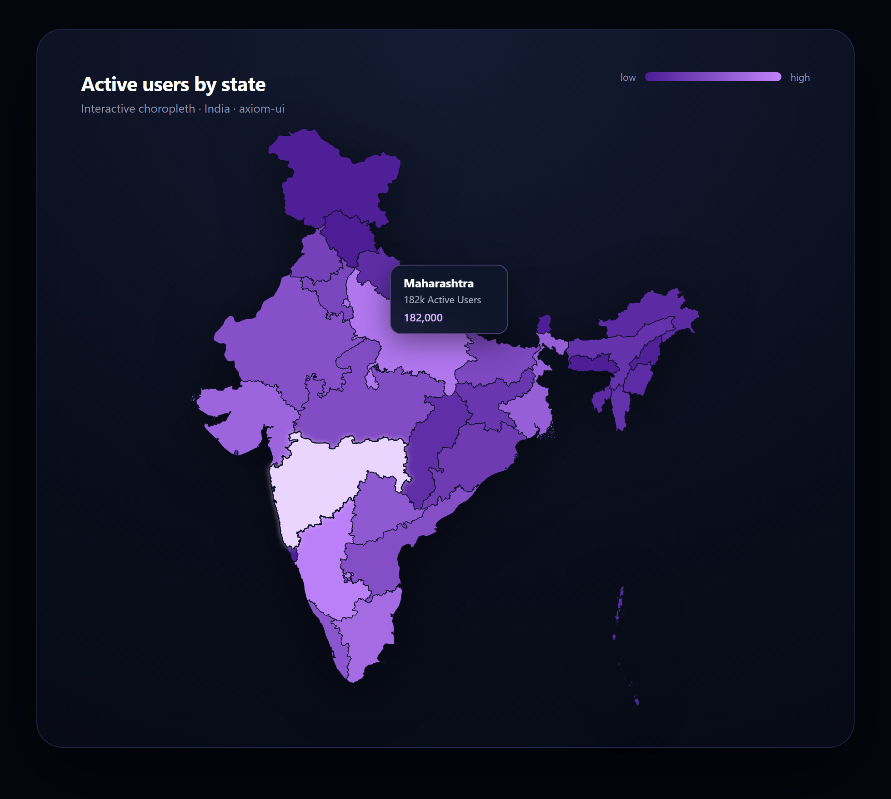

# India Map — React Component

A production-grade, highly interactive SVG India map for React and Next.js. No Leaflet, no Mapbox, no runtime map libraries — just React and an inline path set.

<p align="center">
  
</p>

## Features

- **Accurate geographic paths** — all 36 states and union territories, rendered inline from `india-paths.json`.
- **Dynamic choropleth** — pass numeric `value`s and the map interpolates a heatmap between your `minColor` and `maxColor`.
- **Interactive & accessible** — full keyboard navigation (`Tab` + `Enter`/`Space`), ARIA labels, and screen-reader roles.
- **Floating glassmorphism tooltip** — tracks the cursor to show state name, label, and metric.
- **Hover glow** — SVG `feGaussianBlur` + `feFlood` filter casts an ambient glow on the hovered state.
- **Self-contained** — every colour and behaviour is a prop with a sensible default.

## Install

### Option A — shadcn CLI (recommended)

```bash
npx shadcn@latest add https://raw.githubusercontent.com/atharvax28/axiom-ui/main/registry/india-map.json
```

Drops `IndiaMap.tsx` and `india-paths.json` into your `components/india-map/` directory.

### Option B — copy by hand

Copy [`src/IndiaMap.tsx`](./src/IndiaMap.tsx) and [`src/india-paths.json`](./src/india-paths.json) into the same folder in your project. Requires React 18+. Tailwind is optional — it's only used for a few layout utility classes on the wrapper and tooltip.

## Basic usage

```tsx
import { IndiaMap } from "./india-map/IndiaMap";

export default function App() {
  const mapData = {
    mh: { id: "mh", name: "Maharashtra", value: 145000, label: "145k Active Users" },
    ka: { id: "ka", name: "Karnataka", value: 182000, label: "182k Active Users" },
    dl: { id: "dl", name: "Delhi", value: 120000, label: "120k Active Users" },
  };

  return (
    <IndiaMap
      data={mapData}
      onStateClick={(state) => console.log("Clicked:", state.name)}
      defaultColor="#374151"
      hoverColor="#c084fc"
      strokeColor="#1f2937"
      minColor="#4c1d95"
      maxColor="#a855f7"
    />
  );
}
```

## Props

| Prop | Type | Default | Description |
| ---- | ---- | ------- | ----------- |
| `data` | `Record<string, StateData>` | `{}` | Maps short state codes (`mh`, `ka`, `dl`, …) to data. |
| `onStateClick` | `(state: StateData) => void` | `undefined` | Fired when a state is clicked or activated via keyboard. |
| `onStateHover` | `(state: StateData \| null) => void` | `undefined` | Fired when the pointer enters/leaves a state. |
| `defaultColor` | `string` | `"#e0e7ff"` | Fill for states with no `value`. |
| `hoverColor` | `string` | `"#6366f1"` | Fill and glow for the hovered state. |
| `strokeColor` | `string` | `"#ffffff"` | Border between states. |
| `strokeWidth` | `number` | `0.8` | Border thickness. |
| `minColor` | `string` | `"#c7d2fe"` | Colour for the lowest `value`. |
| `maxColor` | `string` | `"#3730a3"` | Colour for the highest `value`. |
| `showTooltip` | `boolean` | `true` | Toggle the floating tooltip. |
| `animated` | `boolean` | `true` | Scale/fade-in entrance animation on mount. |
| `className` | `string` | `""` | Extra classes on the wrapper. |
| `width` | `number \| string` | `"100%"` | SVG width. |
| `height` | `number \| string` | `"auto"` | SVG height. |

## Data structure

```typescript
export interface StateData {
  id: string;      // two-letter lowercase code, e.g. "mh"
  name: string;    // display name
  value?: number;  // metric used for choropleth colour
  label?: string;  // sub-text shown in the tooltip
  color?: string;  // explicit fill override (skips choropleth)
}
```

## State codes

`an ap ar as br ch ct dn dd dl ga gj hr hp jk jh ka kl ld mp mh mn ml mz nl or py pb rj sk tn tg tr up ut wb`

## Notes

- Requires `resolveJsonModule: true` in your `tsconfig.json` (the default in Next.js and Vite React-TS templates) so the JSON import type-checks.
- Designed for a dark-themed wrapper — the tooltip uses a translucent dark backdrop. Override the inline styles in `IndiaMap.tsx` for a light theme.

## License

[MIT](../../LICENSE) © Atharva Tayade
